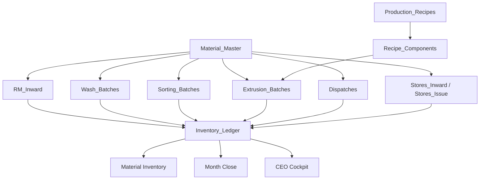

# RegenOS Architecture v1

## Architecture freeze

RegenOS v1 keeps the familiar operator workflow and stabilizes the data model behind it. The platform should not create parallel concepts for the same business object.

## Source of truth map

| Business concept | Source of truth |
|---|---|
| Material definitions | `Material_Master` |
| Machine definitions | `Machine_Master` |
| Inventory | `Inventory_Ledger` |
| Factory overhead | `Factory_Expenses` |
| Production recipes | `Production_Recipes` and `Recipe_Components` |
| Quality results | `RM_Quality` and `FG_Quality` |

## Material Master

`Material_Master` is the only approved source for inventory-affecting material definitions.

Required fields:

- `materialId`
- `materialCode`
- `materialName`
- `category`
- `unit`
- `status`
- `defaultQualityRequired`
- `defaultStorageLocation`

Approved categories:

- `RM`
- `WIP`
- `FG`
- `REWORK`
- `WASTE`
- `STORE`
- `ADDITIVE`

Inventory screens may display `materialName`, but ledger writes must resolve the material through `Material_Master`.

## Recipe Model

Recipes are backend/master data only in v1. They should not be exposed as a complicated operator UI yet.

`Production_Recipes` stores the recipe header:

- `recipeId`
- `recipeCode`
- `recipeName`
- `outputMaterialId`
- `outputMaterialCode`
- `processType`
- `status`

`Recipe_Components` stores one input material per row:

- `componentId`
- `recipeId`
- `inputMaterialId`
- `inputMaterialCode`
- `componentType`
- `standardPercent`
- `standardKg`
- `tolerancePercent`
- `status`

Recipe text, feed composition strings, and combined material descriptions must not be stored as inventory items.

## Inventory Ledger

`Inventory_Ledger` records stock movement only.

Allowed meaning:

- Material
- Quantity
- Movement
- Source
- Destination

Ledger rows must not store:

- Recipe text
- Feed composition
- Operator free text as material
- Combined descriptions
- Bucket names from the experimental model
- Dispatch summaries such as `E1: 25000 Kg`

`Inventory_Ledger` now carries `materialId` so balances can be tied back to `Material_Master`.

## Data flow

## Validation rules

1. Inventory writes must resolve to `Material_Master`.
2. `itemType = MATERIAL_BUCKET` is rejected.
3. Ledger item names containing recipe or combined material patterns are rejected.
4. Dispatch summaries must be split into material and quantity before ledger posting.
5. Bucket/transformation routes are archived and cannot create active inventory.
6. Old familiar screens remain available; their material values must be normalized into Material Master.

## API changes

Added:

- `materialMaster.list`
- `materialMaster.add`
- `materialMaster.update`
- `materialMaster.seedDefaults`
- `productionRecipes.list`
- `productionRecipes.add`
- `productionRecipes.update`
- `recipeComponents.list`
- `recipeComponents.add`
- `recipeComponents.update`

Archived:

- `materialBuckets.*`
- `materialReceiving.*`
- `transformationRuns.*`

These archived routes retain sheet data but do not create active inventory.

## Future migration requirements

Before enabling strict production use:

1. Run `db.runMigrations` to create `Material_Master`, `Production_Recipes`, `Recipe_Components`, and add `materialId` to `Inventory_Ledger`.
2. Run `materialMaster.seedDefaults`.
3. Add any store items from `Stores_Master` into `Material_Master` with category `STORE`.
4. Map active material names in existing operational screens to `Material_Master`.
5. Keep experimental bucket/transformation sheets as hidden/archive-only data.

No historical source-sheet migration is required for this stabilization pass.
