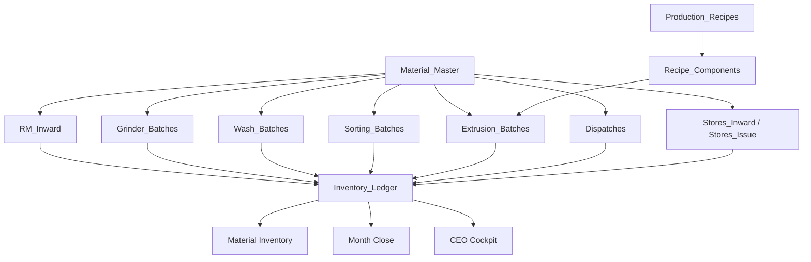

# RegenOS Architecture v1

## Architecture freeze

RegenOS v1 keeps the familiar operator workflow and stabilizes the data model behind it. The platform should not create parallel concepts for the same business object.

## Regen Digital Ecosystem

Regenplastics has three separate digital experiences. They share the business ecosystem, but they should not be mixed unless a planned migration explicitly requires it.

| Experience | Purpose | URL | Local folder | Firebase project |
|---|---|---|---|---|
| Website | Public company website and app gateway | [www.regenplastic.com](http://www.regenplastic.com) | `C:\Users\pratap\regen-website` | `regenwebsiteregenplasticweb` |
| RegenOS | Factory operating system | [https://regen-os.web.app](https://regen-os.web.app) | `C:\Users\pratap\regen-os` | `regen-os` |
| RegenMarketOS | Procurement excellence platform | [https://regenmarketos.web.app](https://regenmarketos.web.app) | `C:\Users\pratap\regen-os\regenmarketos` | `regen-os` |

The website is separate from the internal apps. RegenOS confirms physical stock. RegenMarketOS creates procurement intent only.

## Deployment Commands

RegenOS:

```bash
firebase deploy --only hosting:regenos --project regen-os
```

RegenMarketOS:

```bash
firebase deploy --only hosting:regenmarketos --project regen-os
```

Website:

```bash
firebase deploy --only hosting --project regenwebsiteregenplasticweb
```

## Source of truth map

| Business concept | Source of truth |
|---|---|
| Material definitions | `Material_Master` |
| Production dropdown materials | `Production_Material_Master` |
| Material alias normalization | `Material_Alias_Map` |
| Machine definitions | `Machine_Master` |
| Inventory | `Inventory_Ledger` |
| Factory overhead | `Factory_Expenses` |
| Production recipes | `Production_Recipes` and `Recipe_Components` |
| Quality results | `RM_Quality` and `FG_Quality` |

## Master Connectivity Principle

RegenOS must behave as one connected material system. Adding, renaming, disabling, or reclassifying a material must flow through master data and validation before it affects operations.

Critical connectivity rule:

- `Material_Master` is the ledger authority for every inventory-affecting item.
- `Production_Material_Master` is the production-stage permission layer for operator dropdowns.
- `Stores_Master` is the stores authority for general consumables and spare items.
- A production-approved consumable must be linked to `Material_Master` and allowed in `Production_Material_Master` only for the correct stage/direction.
- General Stores items must never appear in Production Entry, Production History, Dispatch, or production material repair utilities.
- Alias normalization must be centralized so RM Inward, Production Entry, Production History, Inventory Ledger, Live Inventory, Dispatch, Month Close, and migration/repair utilities all resolve the same canonical material names.

When a material is added or changed, RegenOS must check these connected impacts before use:

- RM Inward allowed material list
- Production Entry stage/direction dropdowns
- Production History controlled edit dropdowns
- Inventory Ledger validation and category
- Live Inventory grouping
- Dispatch grade/material validation
- Month Close opening, movement, and closing balances
- Migration and repair utilities

No module should keep a private material naming rule that can diverge from the masters.

`Material_Alias_Map` is the central source for approved old-name to canonical-name mappings. Backend normalization must prefer `Material_Alias_Map`, then fall back to built-in defaults only for backward compatibility. Health checks and migration previews must report aliases that are missing, inactive, or mapped to unknown canonical names.

## Inventory-First Manufacturing Doctrine

Every manufacturing process in RegenOS is an inventory transformation.

A process consumes one or more inventory materials and produces one or more inventory materials.

Operators work from available inventory, not historical batch lists.

Batch/source history remains preserved for:

- QC traceability
- audit
- investigation
- recall
- month-end reconciliation

Primary operating view:

- RM available
- WIP available
- FG available
- Rework available
- Waste available
- Stores available

Every production entry must post:

- inventory consumed
- inventory produced
- variance/loss/rework where applicable

Operators select:

- process
- machine
- input material from available inventory
- output material
- quantities

Operators must not select:

- old GRNs
- historical wash batches
- historical sorting batches
- FG lots

Production flow:

```txt
RM Inward -> Grinder optional -> Wash -> Colour Sorter optional -> Extrusion -> Finished Goods -> Dispatch
```

Grinder is the optional first production process before Wash. It consumes in-house RM buckets and produces the controlled WIP material `White Regrind (Unwashed)`. Grinder must not create finished goods directly. Wash can consume either RM material directly or `White Regrind (Unwashed)` from grinder output stock.

Traceability is drill-down only:

- Why is this stock available?
- Which receiving/production/dispatch records created it?
- Which quality result is linked?

This doctrine is mandatory for RegenOS v1.

## Non-Negotiable Architecture Rules

1. Dispatch consumes FG grades only.
2. Never dispatch from EB batches.
3. Ledger is the inventory source of truth.
4. Material names must be master-driven and normalized.
5. Production History edits must use dropdowns for controlled fields.
6. Free text is allowed only for remarks and notes.
7. Production material dropdowns must use `Production_Material_Master`, never Stores or general consumables.
8. RegenMarketOS creates procurement intent only.
9. RegenOS confirms physical stock.
10. The website is separate from internal apps.

## Material Master

`Material_Master` is the only approved source for inventory-affecting material definitions.

Required fields:

- `materialId`
- `materialCode`
- `materialName`
- `category`
- `unit`
- `status`
- `defaultQualityRequired`
- `defaultStorageLocation`

Approved categories:

- `RM`
- `WIP`
- `FG`
- `REWORK`
- `WASTE`
- `STORE`
- `ADDITIVE`

Inventory screens may display `materialName`, but ledger writes must resolve the material through `Material_Master`.

## Production Material Master

`Production_Material_Master` is the only approved source for Production Entry, Production History production edits, and Dispatch grade dropdowns.

Stores items and general consumables must never appear in production material dropdowns. Store items remain in Stores modules only.

Production dropdowns must show only active canonical production materials allowed for the current stage and direction.

Canonical production materials:

- `White PPCP Buckets`
- `White Regrind (Unwashed)`
- `White Regrind (Washed)`
- `White Sorted Regrind`
- `E1`
- `E2`
- `E3`
- `E4`
- `E5`
- `Virgin PPCP`
- `Battery PPCP`
- `Masterbatch`
- `Dust`
- `Metal Reject`
- `Rubber Reject`
- `Colour Reject`

Aliases must normalize on new saves and edits:

- `Unwashed White Flakes` -> `White Regrind (Unwashed)`
- `White Flakes (Unwashed)` -> `White Regrind (Unwashed)`
- `Grinder Flakes` -> `White Regrind (Unwashed)`
- `Regrinds` -> `White Regrind (Unwashed)`
- `Washed White Flakes` -> `White Regrind (Washed)`
- `White Washed Flakes` -> `White Regrind (Washed)`
- `Washed Regrind` -> `White Regrind (Washed)`
- `White Sorted Flakes` -> `White Sorted Regrind`
- `White Sorted` -> `White Sorted Regrind`
- `Sorted White` -> `White Sorted Regrind`
- `Sorted Material` -> `White Sorted Regrind`
- `Virgin PP` -> `Virgin PPCP`
- `Virgin Material` -> `Virgin PPCP`
- `Battery Scrap` -> `Battery PPCP`
- `Battery Flakes` -> `Battery PPCP`
- `Battery Regrind` -> `Battery PPCP`
- `Master Batch` -> `Masterbatch`

Approved production consumables/additives are not general Stores items:

- `Virgin PPCP` is allowed for RM Inward when procured and for Extrusion input only.
- `Battery PPCP` is allowed for RM Inward when procured and for Extrusion input only; ledger category should normalize to `RM`.
- `Masterbatch` is allowed for RM Inward when procured and for Extrusion input only.
- These materials must not appear as Grinder, Wash, Colour Sorter, or Dispatch materials.

Official classification for production-approved consumables:

- `Virgin PPCP`: `Material_Master` category `ADDITIVE`, `Production_Material_Master` stage `RM_INWARD,EXTRUSION`, direction `INPUT`.
- `Battery PPCP`: `Material_Master` category `RM`, `Production_Material_Master` stage `RM_INWARD,EXTRUSION`, direction `INPUT`.
- `Masterbatch`: `Material_Master` category `ADDITIVE`, `Production_Material_Master` stage `RM_INWARD,EXTRUSION`, direction `INPUT`.
- If purchased or stocked through Stores, the Stores transaction must link back to the same `Material_Master` item instead of creating a separate production name.

Unknown production material names must be reported as `Needs Manual Review`; they must not be auto-fixed blindly.

`Material_Master` remains the ledger authority. `Production_Material_Master` is the production dropdown and validation authority.

## Recipe Model

Recipes are backend/master data only in v1. They should not be exposed as a complicated operator UI yet.

`Production_Recipes` stores the recipe header:

- `recipeId`
- `recipeCode`
- `recipeName`
- `outputMaterialId`
- `outputMaterialCode`
- `processType`
- `status`

`Recipe_Components` stores one input material per row:

- `componentId`
- `recipeId`
- `inputMaterialId`
- `inputMaterialCode`
- `componentType`
- `standardPercent`
- `standardKg`
- `tolerancePercent`
- `status`

Recipe text, feed composition strings, and combined material descriptions must not be stored as inventory items.

## Inventory Ledger

`Inventory_Ledger` records stock movement only.

Allowed meaning:

- Material
- Quantity
- Movement
- Source
- Destination

Ledger rows must not store:

- Recipe text
- Feed composition
- Operator free text as material
- Combined descriptions
- Bucket names from the experimental model
- Dispatch summaries such as `E1: 25000 Kg`

`Inventory_Ledger` now carries `materialId` so balances can be tied back to `Material_Master`.

Production-approved consumable consumption must also post ledger OUT rows when used in production. Extrusion usage of `Virgin PPCP`, `Battery PPCP`, and `Masterbatch` must reduce their available stock through the same ledger source of truth used by Live Inventory and Month Close.

Stores issue to production must not bypass inventory logic. If a Stores item is issued for production consumption, the issue must either:

- post a ledger movement against the linked `Material_Master` item, or
- create an approved production consumption event that posts the ledger movement.

This connection is mandatory before Month Close can reconcile consumable opening stock, inward/purchases, issues to production, production usage, and closing stock reliably.

## Month Close Connectivity

Month Close must reconcile from `Inventory_Ledger`, not from private stage calculations.

Required Month Close model:

- opening balance by canonical material and category
- inward/purchase movements
- production consumption movements
- production output movements
- dispatch movements
- stores issue/consumable usage movements
- physical closing stock
- variance and approved adjustment movements

Month Close must use the same alias normalization and canonical names as Live Inventory. Any material that resolves to `Needs Manual Review` must be blocked from automatic closing until reviewed or explicitly adjusted.

## Data flow



## Validation rules

1. Inventory writes must resolve to `Material_Master`.
2. `itemType = MATERIAL_BUCKET` is rejected.
3. Ledger item names containing recipe or combined material patterns are rejected.
4. Dispatch summaries must be split into material and quantity before ledger posting.
5. Bucket/transformation routes are archived and cannot create active inventory.
6. Old familiar screens remain available; their material values must be normalized into Material Master.

## API changes

Added:

- `materialMaster.list`
- `materialMaster.add`
- `materialMaster.update`
- `materialMaster.seedDefaults`
- `productionRecipes.list`
- `productionRecipes.add`
- `productionRecipes.update`
- `recipeComponents.list`
- `recipeComponents.add`
- `recipeComponents.update`

Archived:

- `materialBuckets.*`
- `materialReceiving.*`
- `transformationRuns.*`

These archived routes retain sheet data but do not create active inventory.

## Future migration requirements

Before enabling strict production use:

1. Run `db.runMigrations` to create `Material_Master`, `Production_Recipes`, `Recipe_Components`, and add `materialId` to `Inventory_Ledger`.
2. Run `materialMaster.seedDefaults`.
3. Add any store items from `Stores_Master` into `Material_Master` with category `STORE`.
4. Map active material names in existing operational screens to `Material_Master`.
5. Keep experimental bucket/transformation sheets as hidden/archive-only data.

No historical source-sheet migration is required for this stabilization pass.

## Current Priority Roadmap

1. Dispatch FG-stock fix: completed.
2. Production History dropdown edits: completed.
3. Grinder production stage: completed.
4. Month Close inventory unification.
5. Live Inventory ledger alignment.
6. Historical ledger repair utility.
7. Firestore migration later.
