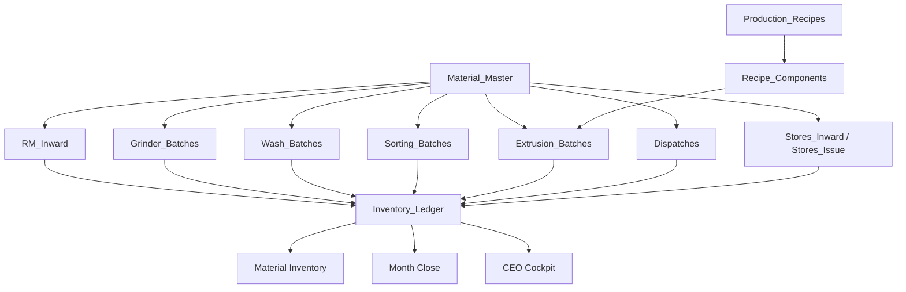

# RegenOS Architecture v1

## Architecture freeze

RegenOS v1 keeps the familiar operator workflow and stabilizes the data model behind it. The platform should not create parallel concepts for the same business object.

## Regen Digital Ecosystem

Regenplastics has three separate digital experiences. They share the business ecosystem, but they should not be mixed unless a planned migration explicitly requires it.

| Experience | Purpose | URL | Local folder | Firebase project |
|---|---|---|---|---|
| Website | Public company website and app gateway | [www.regenplastic.com](http://www.regenplastic.com) | `C:\Users\pratap\regen-website` | `regenwebsiteregenplasticweb` |
| RegenOS | Factory operating system | [https://regen-os.web.app](https://regen-os.web.app) | `C:\Users\pratap\regen-os` | `regen-os` |
| RegenMarketOS | Procurement excellence platform | [https://regenmarketos.web.app](https://regenmarketos.web.app) | `C:\Users\pratap\regen-os\regenmarketos` | `regen-os` |

The website is separate from the internal apps. RegenOS confirms physical stock. RegenMarketOS creates procurement intent only.

## Deployment Commands

RegenOS:

```bash
firebase deploy --only hosting:regenos --project regen-os
```

RegenMarketOS:

```bash
firebase deploy --only hosting:regenmarketos --project regen-os
```

Website:

```bash
firebase deploy --only hosting --project regenwebsiteregenplasticweb
```

## Source of truth map

| Business concept | Source of truth |
|---|---|
| Material definitions | `Material_Master` |
| Production dropdown materials | `Production_Material_Master` |
| Machine definitions | `Machine_Master` |
| Inventory | `Inventory_Ledger` |
| Factory overhead | `Factory_Expenses` |
| Production recipes | `Production_Recipes` and `Recipe_Components` |
| Quality results | `RM_Quality` and `FG_Quality` |

## Inventory-First Manufacturing Doctrine

Every manufacturing process in RegenOS is an inventory transformation.

A process consumes one or more inventory materials and produces one or more inventory materials.

Operators work from available inventory, not historical batch lists.

Batch/source history remains preserved for:

- QC traceability
- audit
- investigation
- recall
- month-end reconciliation

Primary operating view:

- RM available
- WIP available
- FG available
- Rework available
- Waste available
- Stores available

Every production entry must post:

- inventory consumed
- inventory produced
- variance/loss/rework where applicable

Operators select:

- process
- machine
- input material from available inventory
- output material
- quantities

Operators must not select:

- old GRNs
- historical wash batches
- historical sorting batches
- FG lots

Production flow:

```txt
RM Inward -> Grinder optional -> Wash -> Colour Sorter optional -> Extrusion -> Finished Goods -> Dispatch
```

Grinder is the optional first production process before Wash. It consumes in-house RM buckets and produces the controlled WIP material `White Regrind (Unwashed)`. Grinder must not create finished goods directly. Wash can consume either RM material directly or `White Regrind (Unwashed)` from grinder output stock.

Traceability is drill-down only:

- Why is this stock available?
- Which receiving/production/dispatch records created it?
- Which quality result is linked?

This doctrine is mandatory for RegenOS v1.

## Non-Negotiable Architecture Rules

1. Dispatch consumes FG grades only.
2. Never dispatch from EB batches.
3. Ledger is the inventory source of truth.
4. Material names must be master-driven and normalized.
5. Production History edits must use dropdowns for controlled fields.
6. Free text is allowed only for remarks and notes.
7. Production material dropdowns must use `Production_Material_Master`, never Stores or general consumables.
8. RegenMarketOS creates procurement intent only.
9. RegenOS confirms physical stock.
10. The website is separate from internal apps.

## Material Master

`Material_Master` is the only approved source for inventory-affecting material definitions.

Required fields:

- `materialId`
- `materialCode`
- `materialName`
- `category`
- `unit`
- `status`
- `defaultQualityRequired`
- `defaultStorageLocation`

Approved categories:

- `RM`
- `WIP`
- `FG`
- `REWORK`
- `WASTE`
- `STORE`
- `ADDITIVE`

Inventory screens may display `materialName`, but ledger writes must resolve the material through `Material_Master`.

## Production Material Master

`Production_Material_Master` is the only approved source for Production Entry, Production History production edits, and Dispatch grade dropdowns.

Stores items and general consumables must never appear in production material dropdowns. Store items remain in Stores modules only.

Production dropdowns must show only active canonical production materials allowed for the current stage and direction.

Canonical production materials:

- `White Buckets`
- `Mixed Buckets`
- `White Regrind (Unwashed)`
- `White Regrind (Washed)`
- `White Sorted Regrind`
- `E1`
- `E2`
- `E3`
- `E4`
- `E5`
- `Dust`
- `Metal Reject`
- `Rubber Reject`
- `Colour Reject`

Aliases must normalize on new saves and edits:

- `Unwashed White Flakes` -> `White Regrind (Unwashed)`
- `White Flakes (Unwashed)` -> `White Regrind (Unwashed)`
- `Grinder Flakes` -> `White Regrind (Unwashed)`
- `Regrinds` -> `White Regrind (Unwashed)`
- `Washed White Flakes` -> `White Regrind (Washed)`
- `White Washed Flakes` -> `White Regrind (Washed)`
- `Washed Regrind` -> `White Regrind (Washed)`
- `White Sorted Flakes` -> `White Sorted Regrind`

Unknown production material names must be reported as `Needs Manual Review`; they must not be auto-fixed blindly.

`Material_Master` remains the ledger authority. `Production_Material_Master` is the production dropdown and validation authority.

## Recipe Model

Recipes are backend/master data only in v1. They should not be exposed as a complicated operator UI yet.

`Production_Recipes` stores the recipe header:

- `recipeId`
- `recipeCode`
- `recipeName`
- `outputMaterialId`
- `outputMaterialCode`
- `processType`
- `status`

`Recipe_Components` stores one input material per row:

- `componentId`
- `recipeId`
- `inputMaterialId`
- `inputMaterialCode`
- `componentType`
- `standardPercent`
- `standardKg`
- `tolerancePercent`
- `status`

Recipe text, feed composition strings, and combined material descriptions must not be stored as inventory items.

## Inventory Ledger

`Inventory_Ledger` records stock movement only.

Allowed meaning:

- Material
- Quantity
- Movement
- Source
- Destination

Ledger rows must not store:

- Recipe text
- Feed composition
- Operator free text as material
- Combined descriptions
- Bucket names from the experimental model
- Dispatch summaries such as `E1: 25000 Kg`

`Inventory_Ledger` now carries `materialId` so balances can be tied back to `Material_Master`.

## Data flow



## Validation rules

1. Inventory writes must resolve to `Material_Master`.
2. `itemType = MATERIAL_BUCKET` is rejected.
3. Ledger item names containing recipe or combined material patterns are rejected.
4. Dispatch summaries must be split into material and quantity before ledger posting.
5. Bucket/transformation routes are archived and cannot create active inventory.
6. Old familiar screens remain available; their material values must be normalized into Material Master.

## API changes

Added:

- `materialMaster.list`
- `materialMaster.add`
- `materialMaster.update`
- `materialMaster.seedDefaults`
- `productionRecipes.list`
- `productionRecipes.add`
- `productionRecipes.update`
- `recipeComponents.list`
- `recipeComponents.add`
- `recipeComponents.update`

Archived:

- `materialBuckets.*`
- `materialReceiving.*`
- `transformationRuns.*`

These archived routes retain sheet data but do not create active inventory.

## Future migration requirements

Before enabling strict production use:

1. Run `db.runMigrations` to create `Material_Master`, `Production_Recipes`, `Recipe_Components`, and add `materialId` to `Inventory_Ledger`.
2. Run `materialMaster.seedDefaults`.
3. Add any store items from `Stores_Master` into `Material_Master` with category `STORE`.
4. Map active material names in existing operational screens to `Material_Master`.
5. Keep experimental bucket/transformation sheets as hidden/archive-only data.

No historical source-sheet migration is required for this stabilization pass.

## Current Priority Roadmap

1. Dispatch FG-stock fix: completed.
2. Production History dropdown edits: completed.
3. Grinder production stage: completed.
4. Month Close inventory unification.
5. Live Inventory ledger alignment.
6. Historical ledger repair utility.
7. Firestore migration later.
